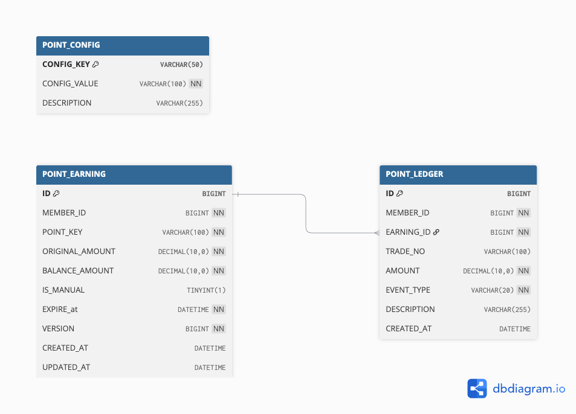

# 무료 포인트 시스템(API)

## 개요
이 프로젝트는 사용자를 위한 무료 포인트를 관리하는 API 서버입니다. 포인트 적립, 적립취소, 사용, 사용취소 기능을 제공합니다.

## 주요 기능

### 1. 포인트 적립
- **적립 한도 관리**:
    - 1회 적립 가능 포인트는 1~10만 포인트 범위 내 (시스템 설정으로 관리)
    - 개인별 최대 보유 포인트 한도 설정 지원 (시스템 설정으로 관리)
- **포인트 추적**: 적립된 포인트는 1원 단위까지 사용 내역 추적 가능
- **관리자 수기 지급**: 관리자가 수기로 포인트 지급 가능 (일반 적립과 구분하여 식별)
- **만료일 관리**: 모든 포인트에 만료일 부여 (1일~5년 미만 설정 가능, 기본값 365일)

### 2. 포인트 적립 취소
- **조건부 취소**: 특정 적립 건에 대해 전체 금액 취소 가능
- **사용 여부 검증**: 적립된 포인트 중 일부라도 사용된 경우 취소 불가

### 3. 포인트 사용
- **사용 조건**: 주문 시에만 포인트 사용 가능
- **사용 내역 기록**: 주문번호와 함께 사용 내역 기록하여 추적 가능
- **사용 우선순위**:
    - 1순위: 관리자 수기 지급 포인트
    - 2순위: 만료일이 짧게 남은 포인트 순서

### 4. 포인트 사용 취소
- **부분 취소**: 사용한 포인트의 전체 또는 일부 취소 가능
- **만료 포인트 재발급**: 사용 취소 시점에 이미 만료된 포인트는 동일 금액으로 신규 적립 처리

## 기술 스택 
- Java 21
- Spring Boot 3.5.9
- H2 데이터베이스
- Lombok
- Gradle 9.2.1

## 서버 모듈 구성

### api 모듈
API 모듈은 HTTP 엔드포인트를 제공하고 클라이언트 요청을 처리하는 메인 모듈입니다.
레이어드 아키텍처(Layered Architecture) 패턴을 따르며 다음과 같은 계층 구조로 구성되어 있습니다:

- **presentation 계층**
    - 클라이언트 요청 처리 및 응답 반환
    - HTTP 엔드포인트 정의 (point.http 파일에서 확인 가능)
    - 요청/응답 DTO 모델 관리

- **application 계층**
    - `PointService`: 포인트 적립, 적립 취소, 사용, 사용 취소 등 비즈니스 로직 처리
    - Command and Query Separation (CQS) 패턴 적용
    - Command DTO: 상태 변경 작업(적립, 사용, 취소 등)을 위한 데이터 전달 객체
    - Info DTO: 조회 작업을 위한 데이터 전달 객체로, 상태를 변경하지 않음
      - 데이터 검증 및 비즈니스 규칙 적용
      - 트랜잭션 처리 및 동시성 제어

- **infrastructure 계층**
    - 외부 시스템 연동을 위한 어댑터 패턴 구현
    - 레포지토리 구현체와 데이터베이스 상호작용
    - 포인트 설정 관리 및 접근 인터페이스
- **Domain 계층**
  - 아래 data-point 모듈로 분리해서 추후 확장성을 고려

### data-point 모듈
데이터 접근 계층을 담당하는 모듈로, 데이터베이스와의 상호작용을 추상화합니다.

- **model 패키지**
    - `PointEarning`: 포인트 적립 정보를 관리하는 엔티티
    - `PointLedger`: 포인트 사용 및 변동 이력을 관리하는 원장 엔티티
    - `PointConfig`: 포인트 시스템 설정 정보 관리 엔티티
  - 기본 엔티티 추상 클래스
    - `CreatedDateAuditEntity`: 생성 일시를 자동으로 관리하는 기본 엔티티 클래스
    - `DateAuditEntity`: 생성 및 수정 일시를 자동으로 관리하는 기본 엔티티 클래스

- **repository 패키지**
    - `PointEarningJpaRepository`: 포인트 적립 정보 CRUD 및 조회 기능
    - `PointLedgerJpaRepository`: 포인트 원장 관리 및 이력 조회 기능
    - `PointConfigJpaRepository`: 포인트 설정 정보 관리
    - Spring Data JPA 인터페이스 제공

### common 모듈
여러 모듈에서 공통으로 사용되는 유틸리티 클래스와 헬퍼 함수들을 제공합니다.
- **유틸리티 클래스**: 날짜 변환, 문자열 처리, 숫자 포맷팅 등 공통 기능
- **공통 예외 처리**: 시스템 전반에서 사용되는 예외 클래스 정의
- **상수 값 관리**: 시스템 전체에서 사용되는 상수 값 정의

### config-datasource 모듈
데이터베이스 연결 및 JPA 설정을 관리하는 모듈입니다.
- **데이터소스 설정**: 데이터베이스 연결 정보 및 커넥션 풀 설정
- **JPA 설정**: 엔티티 매니저, 트랜잭션 매니저 등 JPA 관련 설정

### config-http-message-converter 모듈
HTTP 요청/응답 변환을 담당하는 모듈입니다.
- **JSON 변환**: 객체와 JSON 간의 변환 설정
- **HTTP 메시지 컨버터**: 요청/응답 메시지 처리를 위한 커스텀 컨버터
- **직렬화/역직렬화 설정**: 날짜, 시간 등 특수 타입 처리 설정

### config-object-mapper 모듈
객체 매핑 및 변환을 위한 설정 모듈입니다.
- **Jackson 설정**: JSON 직렬화/역직렬화 세부 설정
- **객체 변환 유틸리티**: 다양한 객체 간 변환 기능 제공
- **커스텀 직렬화/역직렬화**: 복잡한 객체 구조 처리 기능

### config-spring-docs 모듈
API 문서화를 위한 설정 모듈입니다.
- **Springdoc/Swagger 설정**: API 문서 자동화 설정
- **문서 커스터마이징**: API 그룹, 태그, 설명 등 커스터마이징
- **보안 설정**: API 문서 접근 제어 및 인증 설정

## 주요 컴포넌트

### 서비스 계층
- `PointService`: 포인트 관련 모든 비즈니스 로직 처리
    - 포인트 적립(earn)
    - 포인트 회수(revoke)
    - 포인트 사용(use)
    - 포인트 환불(refund)
    - 포인트 원장 관리(addLedger)
    - 포인트 한도 검증(validateEarningLimit, validateBalanceLimit)

### 모델
- `PointEarning`: 포인트 적립 정보 모델
- `PointLedger`: 포인트 원장 모델
- `PointConfig`: 포인트 설정 모델

### 데이터 액세스
- `PointEarningRepository`: 포인트 적립 정보 관리
- `PointLedgerRepository`: 포인트 원장 관리
- `PointConfigRepository`: 포인트 설정 관리

## 데이터베이스 스키마
포인트 시스템은 다음과 같은 테이블 구조를 사용합니다:

### ERD


### 1. POINT_CONFIG (포인트 정책 설정 정보)
포인트 정책 설정 정보를 관리하는 테이블입니다.

| 컬럼명 (Physical) | 논리명 (Logical) | 타입 (Type) | 제약조건 (Constraint) | 설명 |
| :--- | :--- | :--- | :--- | :--- |
| **CONFIG_KEY** | **설정 키** | VARCHAR(50) | PK | 설정 식별자 키 |
| CONFIG_VALUE | 설정 내용 값 | VARCHAR(100) | NOT NULL | 실제 설정값 |
| DESCRIPTION | 상세 설명 | VARCHAR(255) | - | 해당 설정에 대한 상세 설명 |

### 2. POINT_EARNING (포인트 적립 내역 및 잔액 관리)
포인트 적립 내역 및 잔액을 관리하는 테이블입니다.

| 컬럼명 (Physical) | 논리명 (Logical) | 타입 (Type) | 제약조건 (Constraint) | 설명 |
| :--- | :--- | :--- | :--- | :--- |
| **ID** | **적립 ID** | BIGINT | PK, AI | 고유 식별자 (Auto Increment) |
| MEMBER_ID | 회원 ID | BIGINT | NOT NULL | 포인트 소유 회원 ID |
| POINT_KEY | 포인트 키 | VARCHAR(100) | UNIQUE, NOT NULL | 중복 적립 방지용 고유 키 |
| ORIGINAL_AMOUNT | 최초 적립 금액 | DECIMAL(10, 0) | NOT NULL | 처음 적립된 포인트 양 |
| BALANCE_AMOUNT | 잔여 포인트 | DECIMAL(10, 0) | NOT NULL | 현재 사용 가능한 남은 포인트 |
| IS_MANUAL | 수기 적립 여부 | TINYINT(1) | DEFAULT 0 | 관리자 수기 적립 여부 (0: false, 1: true) |
| EXPIRE_AT | 만료 일시 | DATETIME | NOT NULL | 포인트 만료 예정 일시 |
| VERSION | 버전 번호 | BIGINT | DEFAULT 0, NOT NULL | 낙관적 락(Optimistic Lock)을 위한 버전 |
| CREATED_AT | 생성 일시 | DATETIME | DEFAULT NOW | 데이터 생성 시간 |
| UPDATED_AT | 수정 일시 | DATETIME | DEFAULT NOW | 데이터 최종 수정 시간 (자동 갱신) |

### 3. POINT_LEDGER (포인트 원장 - 적립/사용 상세 트랜잭션 기록)
포인트 원장(적립/사용 상세 트랜잭션 기록)을 관리하는 테이블입니다.

| 컬럼명 (Physical) | 논리명 (Logical) | 타입 (Type) | 제약조건 (Constraint) | 설명 |
| :--- | :--- | :--- | :--- | :--- |
| **ID** | **원장 ID** | BIGINT | PK, AI | 원장 고유 식별자 |
| MEMBER_ID | 회원 ID | BIGINT | NOT NULL | 회원 식별자 |
| EARNING_ID | 연관 적립 ID | BIGINT | FK, NOT NULL | POINT_EARNING 테이블 참조 외래키 |
| TRADE_NO | 거래 번호 | VARCHAR(100) | - | 주문번호 또는 트랜잭션 ID |
| AMOUNT | 변동 포인트 | DECIMAL(10, 0) | NOT NULL | 증감된 포인트 금액 |
| EVENT_TYPE | 이벤트 유형 | VARCHAR(20) | NOT NULL | EARN, REVOKE, USE, REFUND, EXPIRE_REINSTATE |
| DESCRIPTION | 상세 내역 | VARCHAR(255) | - | 변동 사유 상세 설명 |
| CREATED_AT | 생성 일시 | DATETIME | DEFAULT NOW | 거래 발생 시간 |

## 주요 특징
- **낙관적 락 처리**: 포인트 사용 시 동시성 이슈 해결을 위한 낙관적 락 적용
- **재시도 메커니즘**: 락 충돌 시 최대 3번, 0.1초 간격으로 재시도
- **만료 포인트 관리**: 만료된 포인트 재발급 처리
- **한도 관리**: 1회 적립 한도 및 개인별 최대 보유 한도 검증

## 모듈 간 통신
- **api → data-point**: API 모듈은 데이터 접근을 위해 data-point 모듈의 Repository 인터페이스를 사용
- **api → common**: 공통 유틸리티 활용
- **api → config-***: 각종 설정 모듈 의존
- **의존성 방향**: 상위 계층이 하위 계층에 의존하는 단방향 구조
- **명확한 관심사 분리**: 각 모듈은 특정 역할과 책임에 집중

## API 엔드포인트
프로젝트의 point.http 파일에서 API 요청 예시를 확인할 수 있습니다.


## 시작하기

### 요구사항
- JDK 21
- Gradle

### 설치 및 실행
1. **저장소 클론**:
```
   git clone https://github.com/danielkim16/point-server.git
   
   or
   
   git clone git@github.com:danielkim16/point-server.git
```

2. **프로젝트 빌드**:
```bash
   ./gradlew clean build
```

3. **API 서버 실행**:
```bash
  ./gradlew :api:bootRun --args='--spring.profiles.active=local'
```

4. **API 서버 헬스 체크**:
```bash 
  curl -X GET http://localhost:8080/health
```

5. **H2 콘솔 접속**:
```
http://localhost:8080/h2-console
```
브라우저를 열고 위 주소를 입력하면 H2 데이터베이스 콘솔에 접속 할 수 있습니다.

**로그인 정보**:
- JDBC URL: jdbc:h2:mem:pointdb (또는 설정된 DB URL)
- 사용자명: point
- 비밀번호: (공란으로 두세요)

'연결' 버튼을 클릭하여 데이터베이스 관리 인터페이스에 접속합니다.

6. **API 문서 확인**:
```
http://localhost:8080/swagger-ui/index.html
```
Swagger UI를 통해 API 문서를 확인하고 테스트할 수 있습니다.
이 페이지에서 모든 사용 가능한 API 엔드포인트와 그 사용법을 확인할 수 있습니다.


